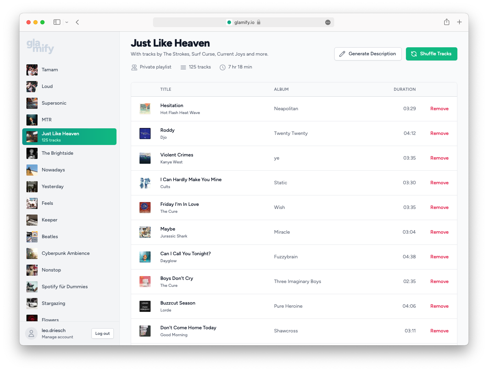

<h1 align="center">
  <picture>
    <source media="(prefers-color-scheme: dark)" srcset="./readme-assets/logo-github-dark.png">
    
  </picture>
</h1>

    <strong> Manage and spice up your Spotify playlists. </strong>

 
    
    

    <a href="#-screenshots"><b>Screenshots</b></a>
      •  
    <a href="#-development"><b>Development</b></a>
      •  
    <a href="#-contribute"><b>Contribute</b></a>  

---

[glamify](https://glamify.io/) is a tool for Spotify to manage your playlists.

Currently it is able to remove tracks from the playlist in one click, shuffle the order of tracks in your playlist and give it an automated description with the most occuring artists of a given playlist.

I'd also like to add automated playlist images in the future.

 

## ❯ Screenshots

 

## ❯ Development

1. **Requirements**

    You should have an LTS version of [Node.js](https://nodejs.org/en/)
    installed.

2. **Install the dependencies**

    Run `npm install` to install all neccesary packages.

3. **Run the Next.js development server**

    Start the development server by running `npm run dev`.

 

## ❯ Contribute

If you think you have any ideas that could benefit the project, feel free to
create a pull request!

 

---

    
        Project by Leo Driesch, released under <a href="https://github.com/leodr/glamify/blob/main/LICENSE">MIT license</a>.
    

    
    &nbsp;&nbsp;
    

